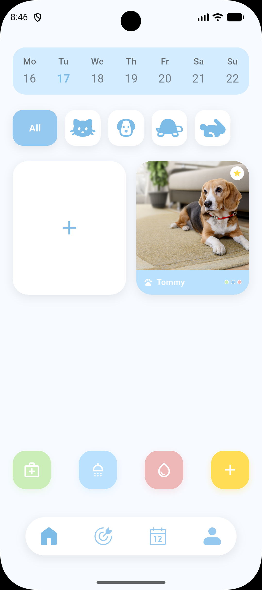
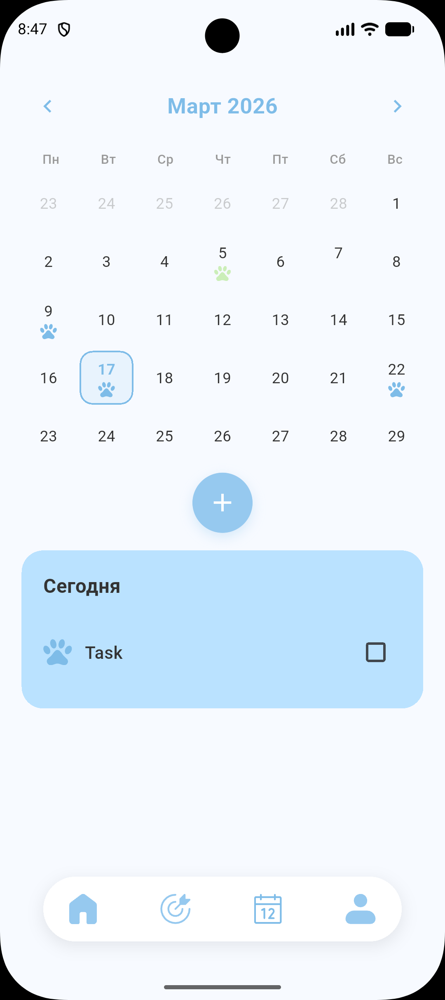
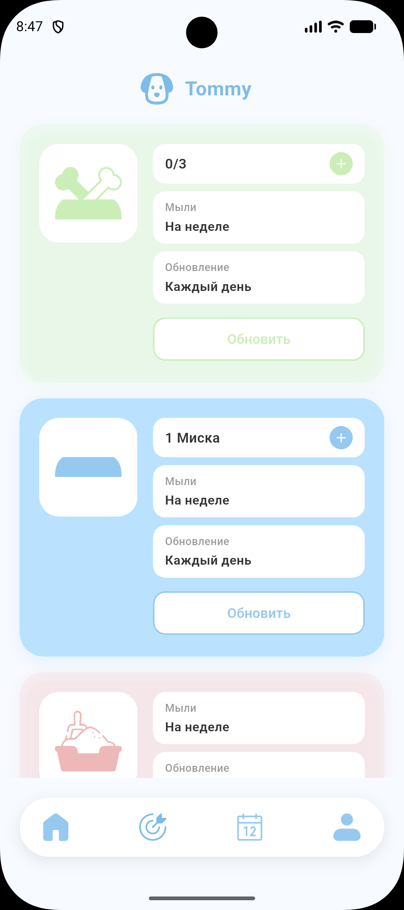
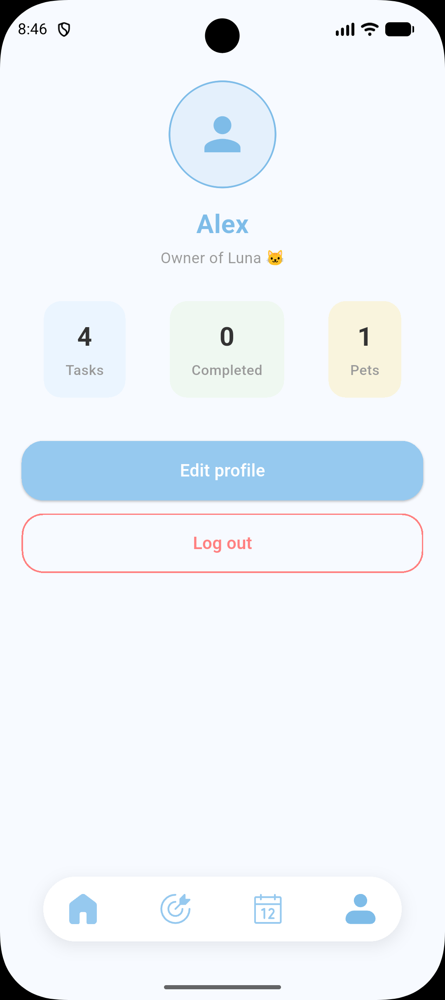

# PetO — Pet + Todo

**Ваш персональный помощник для заботы о питомцах**

[](https://flutter.dev)
[](https://dart.dev)
[](https://riverpod.dev)
[](https://pub.dev/packages/go_router)

---

## О проекте

**PetO** — это мобильное приложение для владельцев питомцев, которое помогает отслеживать здоровье, планировать визиты к ветеринару и хранить всю важную информацию о ваших любимцах в одном месте.

## 📱 Основные экраны приложения

| Главный экран | Календарь здоровья | Отметки по уходу | Профиль пользователя |
|:---:|:---:|:---:|:---:|
|  |  |  |  |
| Дашборд питомцев | Планирование задач | Отметки | Настройки аккаунта |

---

### Основные возможности

| Функция | Описание |
|---------|----------|
|  **Профиль питомца** | Добавление и редактирование информации о питомце (имя, порода, возраст, фото) |
|  **Календарь задач** | Планирование визитов к ветеринару, прививок, груминга и других событий |
|  **Трекер здоровья** | Отслеживание вакцинаций, приёма лекарств и медицинских показателей |
|  **Профиль владельца** | Управление аккаунтом и настройками приложения |
|  **UI Kit** | Единая дизайн-система с адаптивными компонентами |

---

## Технологический стек

| Категория | Технологии |
|-----------|------------|
| **Фреймворк** | Flutter 3.0+ |
| **Язык** | Dart 3.0+ |
| **Состояние** | Riverpod 2.0+ |
| **Навигация** | GoRouter 14.0+ |
| **Бэкенд** | Firebase (Auth, Firestore, Storage) |
| **Локальное хранилище** | Hive, SecureStorage |
| **Модели** | Freezed, JsonSerializable, Equatable |
| **Тестирование** | Mockito, Mocktail, Golden Tests |

---

## Безопасность
    Валидация данных на клиенте перед отправкой
    Firebase Security Rules для защиты коллекций
    Хранение чувствительных данных в SecureStorage

## Быстрый старт

### Требования

- Flutter SDK `3.0+`
- Dart SDK `3.0+`
- Android Studio / VS Code
- Firebase проект (опционально)

### Установка

```bash
# 1. Клонируйте репозиторий
git clone https://github.com/LinaOwOo/Peto.git
cd peto
